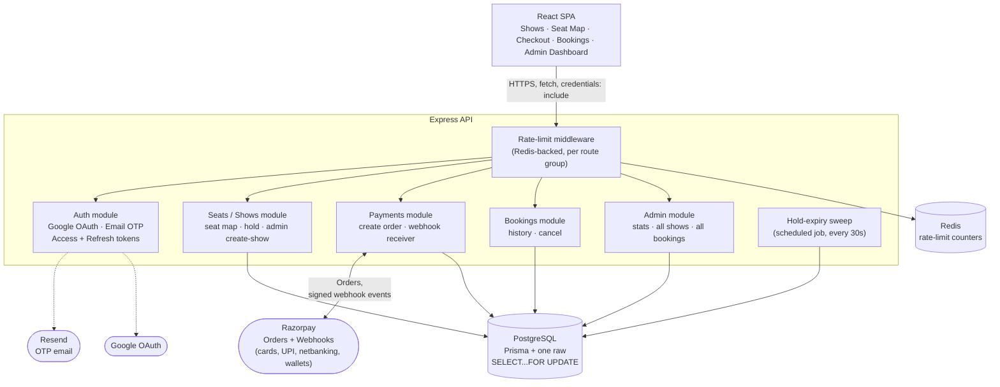
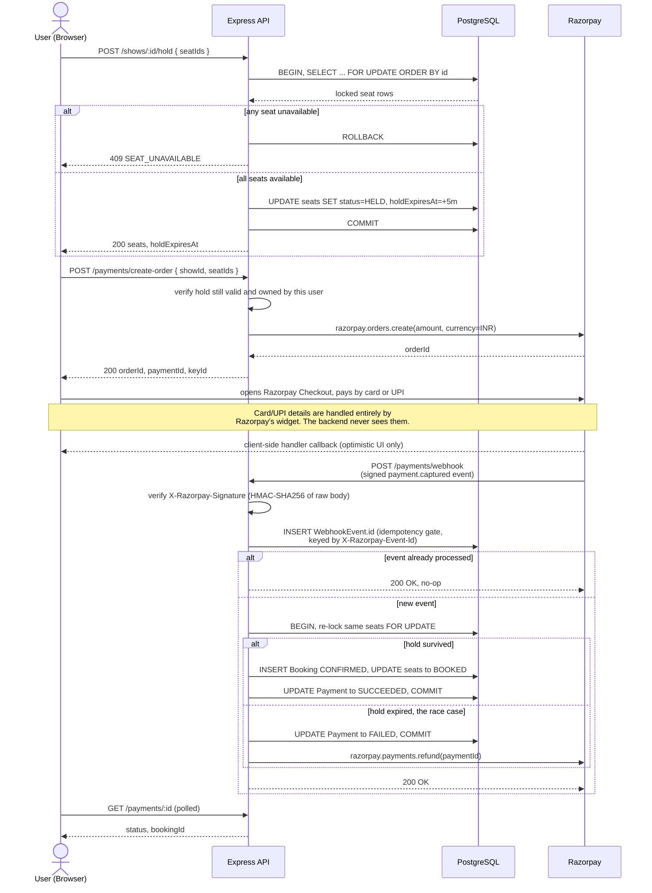
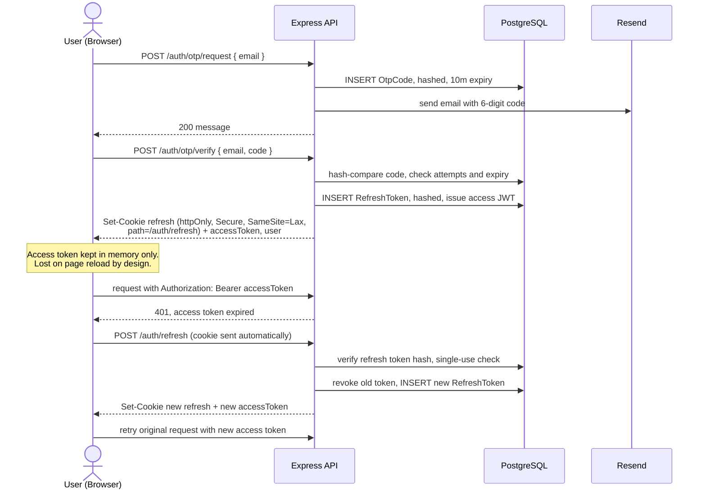
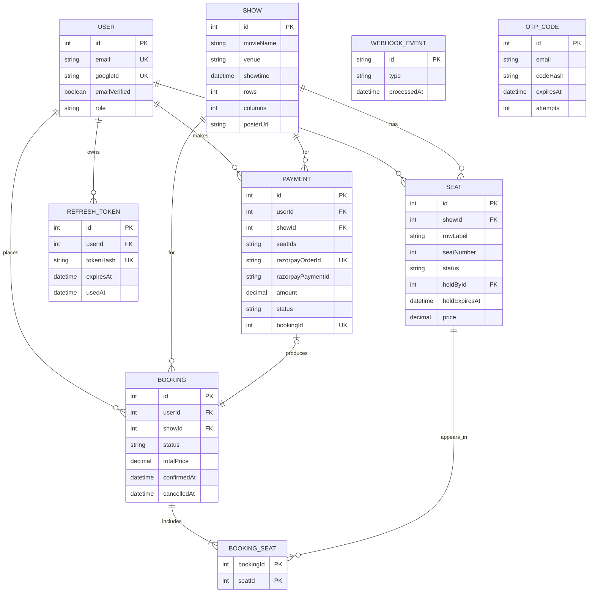
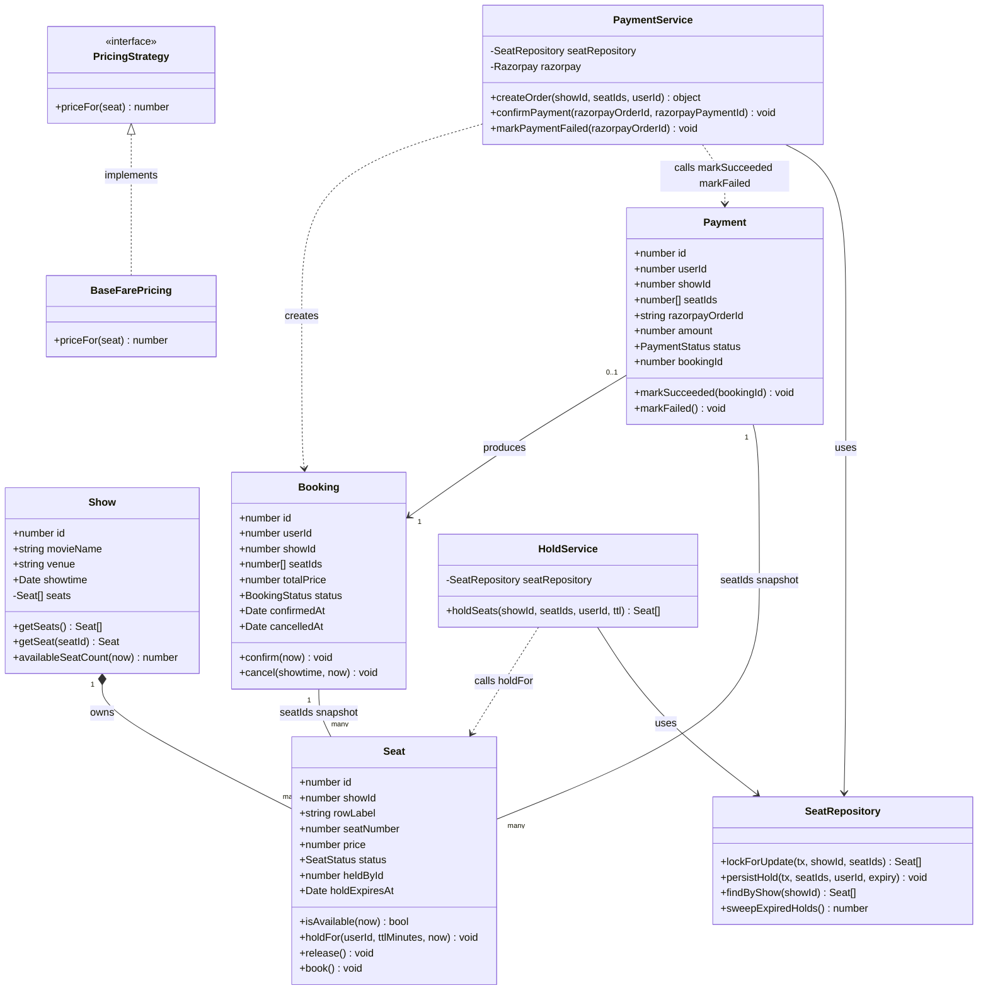

<div align="center">

# SeatLock

### A concurrent movie-seat booking system. You browse shows, pick seats on a live seat map, hold them for 5 minutes, and pay by card or UPI — a booking only ever gets confirmed by a verified Razorpay webhook, never by the client's say-so.

[](#testing)
[](#tech-stack)
[](#1-concurrency-pessimistic-locking-with-ordered-lock-acquisition)
[](#2-payments-webhook-only-confirmation-never-the-client)
[](#auth-design)

</div>

---

SeatLock is built around three deliberately hard engineering problems, each proven under real conditions rather than just claimed:

1. A normalized relational schema with real constraints (not JSON blobs).
2. A domain modeled with actual classes that have behavior, not database rows passed around.
3. A concrete, defensible concurrency-control strategy, proven under genuine concurrent load — not assumed to work.

---

## Contents

- [Tech stack](#tech-stack)
- [System architecture](#system-architecture)
- [Request flow](#request-flow)
- [Database schema](#database-schema)
- [Class diagram](#class-diagram)
- [The four decisions worth understanding](#the-four-decisions-worth-understanding)
- [Auth design](#auth-design)
- [Admin dashboard](#admin-dashboard)
- [Known limitations](#known-limitations-deliberate-scope-cuts-not-oversights)
- [Project structure](#project-structure)
- [Running it locally](#running-it-locally)
- [Testing](#testing)
- [At scale: handling a blockbuster's opening night](#at-scale-handling-a-blockbusters-opening-night)

---

## Tech stack

| Layer | Choice | Why |
|---|---|---|
| Language | TypeScript (backend + frontend) | Plain classes/interfaces throughout — no generics beyond what Prisma forces, no decorators, no mapped/conditional types. Every class is meant to be explainable line-by-line. |
| Backend | Express | Deliberately less structured than NestJS — the service/repository/domain-class organization is designed by hand, not scaffolded, because that organization is the point of the project. |
| Database | PostgreSQL | Real transactions and row-level locking — the actual reason this project exists. |
| ORM | Prisma | Type-safe for everything except the one place it can't help: `SELECT ... FOR UPDATE`. That one query is raw SQL through Prisma's `$queryRaw` escape hatch; everything else goes through the normal client. |
| Auth | Google OAuth + email OTP (one-time code, no passwords anywhere) | See [Auth design](#auth-design). |
| Rate limiting | Redis (Upstash, REST-based) | See [decision #3](#3-rate-limiting-redis-backed-per-route-group-fails-open). |
| Payments | Razorpay (test mode), Orders API + webhooks — cards and UPI both, one integration | See [decision #2](#2-payments-webhook-only-confirmation-never-the-client). |
| Email | Resend | OTP code delivery. |
| Frontend | React + TypeScript + Vite, plain CSS Modules | No Redux/React Query — React Context for auth state, a hand-written typed `fetch` wrapper for the API client. Deliberately minimal; the backend is the point. |
| Testing | Vitest + Supertest | 159 backend tests, run against a **real** local Postgres, **real** Upstash Redis, and **real** Razorpay test-mode API — not mocks. See [Testing](#testing) for why. |

---

## System architecture



Routes stay thin — they parse/validate the request, call into a service class, and translate the result (or thrown domain error) into an HTTP response. The actual logic lives in:

- **Domain classes** (`src/domain/`) — `Seat`, `Show`, `Booking`, `Payment`, `PricingStrategy`. Plain classes, no DB access, fully unit-tested in isolation. `Seat.holdFor()`, `Booking.cancel()`, `Payment.markSucceeded()` etc. encode the actual business rules (what counts as available, what transitions are legal) once, and every service reuses them instead of re-implementing the logic inline.
- **Service classes** (`HoldService`, `PaymentService`, `BookingService`, `ShowService`, `OtpService`) — orchestrate a transaction: lock/fetch data, hand it to the domain class, persist the result.
- **`SeatRepository`** — the *only* place raw SQL appears in the whole app, scoped to exactly the lock query. Everything else goes through Prisma's normal type-safe client.
- **Admin module** (`src/admin/`) — read-only, admin-gated aggregation over the same Prisma models (per-show seat/revenue stats, cross-user booking listing); it doesn't introduce any new write path or domain rule of its own.

---

## Request flow

### Hold → pay → webhook confirmation

This is the flow the rest of the README exists to justify — a seat is provisionally reserved by a row lock, paid for out-of-band with Razorpay (card or UPI, the user's choice, inside one hosted widget), and only permanently booked once a signed webhook proves the charge actually happened.



### Auth: OTP sign-in and refresh rotation

Shown separately because it's the flow behind the httpOnly-cookie decision in [Auth design](#auth-design) — the access token never touches persistent storage, and the refresh token never touches JavaScript.



---

## Database schema

| Table | Purpose |
|---|---|
| `User` | Account row. `googleId` and/or email are how it's matched — there's no password column anywhere in the schema. |
| `Show` | A movie + venue + showtime + seat grid dimensions + optional poster URL. |
| `Seat` | Belongs to one `Show`. Carries its own hold state directly (`status`, `heldById`, `holdExpiresAt`) rather than a separate "hold" entity — see the domain class design below. `UNIQUE(showId, rowLabel, seatNumber)` — the database itself refuses a duplicate seat key, not just application code. |
| `Booking` | A confirmed (or cancelled) reservation. Only ever inserted already `CONFIRMED`, by the webhook handler — never by a direct client call. |
| `BookingSeat` | Join table, composite PK `(bookingId, seatId)`. No uniqueness on `seatId` alone — a seat legitimately appears across multiple historical bookings over time (booked → cancelled → rebooked). |
| `Payment` | Tracks a Razorpay order (and the payment ID once captured): which seats it was for (`seatIds`, a snapshot — see below), amount, status, and which booking it resulted in (if any). |
| `WebhookEvent` | `id` is Razorpay's own per-delivery event ID (the `X-Razorpay-Event-Id` header), used purely as an idempotency gate — see decision #2. |
| `RefreshToken` | Hashed, single-use, rotated on every use. |
| `OtpCode` | Hashed, short-lived, attempt-capped. Keyed by email, not `userId`, since the account may not exist yet on first sign-in. |

### Entity-relationship diagram



`Payment.seatIds` is drawn as a plain field, not a relation — it's a point-in-time snapshot of which seats a payment was for, not a live foreign key, which is exactly why it needs to exist (see below).

**Why there's no separate `Hold` table.** The `Seat` domain class carries `status`/`heldById`/`holdExpiresAt` directly rather than pointing at a separate hold entity. A "hold" is just "the current state of some seat rows" — modeling it as a first-class table would mean keeping two things in sync (the hold record and the seat's own status) for no benefit, since a seat can only ever be held by one hold at a time anyway. The `Payment.seatIds` array exists specifically to compensate for this: by the time a webhook arrives, the seats' live state may have moved on, so the payment has to remember what it was *originally* for.

**Money is `DECIMAL(10,2)`, never `FLOAT`**, on every price/amount column — floating-point currency arithmetic is a classic, avoidable bug class.

---

## Class diagram

This is the direct evidence for the project's second goal: real classes with behavior, not rows passed around and mutated inline. Every state transition (`Seat.holdFor`, `Booking.confirm`, `Payment.markSucceeded`, ...) lives on the domain object itself and throws a typed domain error on an illegal transition — services orchestrate transactions, they don't reimplement business rules.



`PricingStrategy` is deliberately the smallest possible strategy-pattern example: one interface, one implementation (`BaseFarePricing`, uniform per-show pricing). It exists to keep pricing logic swappable (peak pricing, seat-tier pricing, ...) without touching `Seat` or any service — not because this project needed more than one strategy today.

---

## The four decisions worth understanding

### 1. Concurrency: pessimistic locking with ordered lock acquisition

**The problem.** Two users click the same seat within milliseconds of each other. Exactly one must win; the other must get a clear, immediate rejection — not a corrupted double-booking, not a hang.

**The mechanism** (`SeatRepository.lockForUpdate`, used by both the hold endpoint and the payment webhook):

```sql
SELECT id, "showId", "rowLabel", "seatNumber", status, "heldById", "holdExpiresAt", price
FROM "Seat"
WHERE "showId" = $1 AND id IN (...)
ORDER BY id
FOR UPDATE
```

Run inside one Postgres transaction: lock the targeted rows, check each one's effective availability (via `Seat.isAvailable()` — the exact same method Milestone-1's unit tests already cover), and if *any* requested seat isn't available, throw — which rolls back the whole transaction, so a failed multi-seat request never holds even the seats that *were* free (`FR-3`, all-or-nothing).

**Why pessimistic over optimistic.** Contention on any single seat is short-lived (a hold transaction is a handful of milliseconds), and correctness matters far more here than squeezing out extra throughput. Optimistic concurrency would mean building and tuning retry-storm handling on an already tight timeline for a benefit that doesn't materialize at this contention level.

**The detail that actually prevents deadlocks: `ORDER BY id`.** Without it, two requests holding overlapping seats in different orders — request A wants seats `[1, 2]`, request B wants `[2, 1]` — can deadlock: A locks row 1 and waits on row 2; B locks row 2 and waits on row 1. Postgres's own deadlock detector would eventually kill one of them with a raw `deadlock detected` error rather than hang forever, but that's still a far worse outcome than a clean `409` — it would surface to the client as an unhandled `500`. Locking rows in a *consistent* order means every transaction requests locks in the same sequence, so the wait-cycle that causes a deadlock can never form.

Worth being honest about: when I deliberately removed `ORDER BY id` and re-ran the reverse-order test, it *didn't* reproduce a deadlock — Postgres's planner, for this simple `id IN (...)` lookup on a small table, already happened to visit rows in ascending `id` order regardless of the literal order in the `IN` list. That's not a reason to drop the clause; it's the reason to keep it. Without `ORDER BY`, that ordering is an accident of the current query plan — the planner is free to pick a different plan (a different index, a sequential scan, parallel workers) as the table grows, and none of those come with an ordering guarantee. `ORDER BY id` turns "happens to be safe right now" into "guaranteed safe by construction," independent of anything the query planner decides later.

**Proof, not assertion:** [`src/seats/concurrency.test.ts`](backend/src/seats/concurrency.test.ts) fires genuinely parallel HTTP requests via `Promise.all` (never sequential `await`s) — first a 10-way race for one seat (exactly 1 succeeds, 9 get a clean `409`, and the DB's actual `heldById` is verified to match the one request that got `200`), then the specific `[1,2]`-vs-`[2,1]` reverse-order case (resolves as a clean `200`/`409` pair, never a `500`).

### 2. Payments: webhook-only confirmation, never the client

**The rule.** A booking is created in exactly one place: the Razorpay webhook handler, after signature verification, after idempotency-checking the event, after re-locking the seats and confirming the hold survived. The client's own claim that payment succeeded is never sufficient — the Order is created upfront, but the actual charge (card or UPI, chosen inside Razorpay's own hosted Checkout widget) happens entirely between the browser and Razorpay; our backend only finds out afterward, asynchronously, via the webhook.

**Why Razorpay, not just Stripe.** The original design used Stripe alone. Once card **and** UPI/QR support both mattered, Stripe stopped being viable at all here — its test account can't accept UPI without a registered India business entity — while Razorpay's Checkout widget offers cards, UPI, netbanking and wallets under one Order/webhook model, so supporting both payment styles didn't mean maintaining two separate payment integrations.

**Idempotency is a database constraint, not a remembered list.** `WebhookEvent.id` is Razorpay's own per-delivery event ID (the `X-Razorpay-Event-Id` header, unique per delivery per Razorpay's docs), and the very first thing the webhook handler does (after verifying the signature) is `INSERT` that ID. At-least-once delivery means the same event can arrive twice; the second attempt hits the table's primary-key uniqueness, the insert fails, and the handler acknowledges without reprocessing — proven directly in [`payments/routes.test.ts`](backend/src/payments/routes.test.ts) by sending the identical signed event twice and asserting only one booking exists afterward.

**The race case, decided deliberately.** A payment can succeed at Razorpay in the same instant the seat's hold expires. Two ways to handle it were on the table:

- *Grace period* — honor the hold a little past its nominal expiry.
- *Refund-and-notify* — if the hold didn't survive, refund the charge and leave the seat exactly as its current state says.

I went with refund-and-notify. A grace period only works if nobody else claimed the seat in the meantime — but this system lets *any* user immediately re-hold a seat the instant it expires (Milestone 3's own design), so honoring a late payment could mean bumping someone who legitimately re-held or even re-booked it in good faith. That's not obviously fairer, just differently unfair, for real added complexity. Refund-and-notify is simpler and never wrong: the seat's actual current state is always the source of truth, nobody is ever double-booked or bumped, and the original payer gets their money back automatically. "Notify" here means a clear server-side log line, not a user-facing email — building real notifications would quietly re-open a scope cut the product requirements explicitly made (no notifications system for this MVP).

[`PaymentService.test.ts`](backend/src/payments/PaymentService.test.ts) drives this against the real Razorpay test API wherever that's actually possible — a real `orders.create()` call, a real re-lock transaction, a real `FAILED` status write, a real untouched seat. One honest gap from the equivalent Stripe setup: Stripe lets a test *complete* a Payment Intent purely server-side (`paymentIntents.confirm` with a test token), so the old race-case test could also assert a genuine refund round-trip. Razorpay's test mode has no headless, server-only way to drive an Order to a real `captured` payment — Checkout (a browser) is required — so there's no real captured payment to refund from a Node test process. The race-case test stubs only that one refund call (`vi.spyOn`, asserted with the correct payment ID and amount); everything else in the same test — the DB transaction, the hold-expiry detection, the `FAILED` write, the seat being left untouched — is real, and the webhook's actual signature verification is proven for real, separately, in `routes.test.ts`.

**On payment failure, the hold is left completely intact — deliberately, not by default.** Razorpay's Order technically allows either "leave the hold to expire normally" or "release it immediately" on a failed charge, same choice Stripe's Payment Intent offered. I chose to leave it alone: a user whose payment fails should be able to retry with a different method *without losing their seat selection or re-holding*, which only works if the hold survives the failure. Releasing it immediately would let someone else grab the seat before the original user can retry.

### 3. Rate limiting: Redis-backed, per-route-group, fails open

Fixed-window counters (`INCR` + `EXPIRE` on first hit) rather than a sliding-window log — simpler to reason about and explain, and sufficient at this scale. Limits are scoped **per route group**, not globally, because login traffic and seat-hold traffic have completely different legitimate rates:

- The whole auth group (`otp/request`, `otp/verify`, `/google`, `/google/callback`) shares one per-IP quota — brute-forcing a login path is the threat, regardless of which specific auth route is hit.
- `otp/request` *additionally* has its own per-email quota — protects one inbox from being spammed regardless of which IP the requests come from.
- `hold` and order creation are rate-limited per authenticated *user*, not IP — the threat there is one account mass-holding seats or hammering Razorpay, not anonymous traffic.

**Deliberately not rate-limited:** `/auth/refresh` (the token itself is high-entropy and unguessable, unlike a password — rate-limiting it doesn't add meaningful defense) and `/payments/webhook` (that's Razorpay calling us, gated by signature verification, not a user-abuse surface).

**Fails open.** If Redis itself is unreachable, the request is let through (and logged) rather than a rate-limiter outage taking the whole API down with it — proven directly with a fake `RateLimiter` whose `checkLimit` always rejects, asserting the request still succeeds.

### 4. Resilience: retrying only what's actually transient

A shared `withRetry` utility (timeout + exponential backoff with jitter, capped attempts) wraps the three genuinely external dependencies: Razorpay calls, outbound email, and DB calls. The part worth actually understanding is *how* it stays safe:

Each call site supplies its own narrow `isRetryable(error)` predicate:

- **DB** (`isRetryableDbError`) returns `true` only for specific Prisma connection-level error codes (`P1001`/`P1002`/`P1008`/`P1017` — can't reach the server, timed out connecting — and `P2024` — pool exhausted). Every one of this project's own thrown domain errors (`SeatUnavailableError`, `SeatNotFoundError`, ...) is, by construction, never an instance of those Prisma error types — so a genuine `409` conflict can't accidentally get retried. That's not a rule that has to be remembered and followed correctly at every call site; it's structurally true no matter where `withRetry` gets wrapped around a DB call. Proven directly: a spy on `prisma.$transaction` shows it gets called *exactly once* when a hold request hits an already-booked seat, even though the whole call is wrapped in retry logic.
- **Razorpay** (`isRetryableRazorpayError`) retries a `5xx`/connection-level failure, never a `4xx` — a declined payment, a bad request, an unauthorized key. Razorpay's SDK doesn't throw a custom `Error` subclass for an API rejection (it rejects with a plain `{ statusCode, error }` object — see `node_modules/razorpay/dist/types/api.d.ts`), so this predicate checks that shape structurally instead of with `instanceof`, plus axios's own network-error shape for a request that never got a response at all. Retrying a decline wouldn't just waste time, it would be actively misleading to the user.
- **Email** (`isRetryableEmailError`) is the interesting edge case: Resend's SDK models an API-level rejection (bad request, sandbox restrictions) as a *resolved* `{ error }` value, never a thrown exception — so anything that actually reaches this predicate is, by construction, a genuine transport failure, and it's safe to always retry.

---

## Auth design

Two sign-in paths — Google OAuth and a 6-digit email OTP — converging on the same access+refresh token pair. **There is no password anywhere in this system**; that was a locked decision reversed mid-project specifically in favor of OTP, deliberately.

- **Access token**: short-lived JWT (15 min default), sent as `Authorization: Bearer`, kept in memory on the client only — never persisted, lost on a page reload by design.
- **Refresh token**: opaque random value, stored **hashed** server-side, delivered to the browser as an **httpOnly, `Secure` (in production), `SameSite=Lax` cookie scoped to exactly `/auth/refresh`** — never readable by JavaScript, never sent on any other request. This was revised mid-project from an earlier "just put it in the JSON response body" decision once the frontend was actually being built: a long-lived refresh token surviving an XSS bug is a meaningfully worse outcome than a 15-minute access token doing the same, so the refresh token specifically gets the stricter treatment while the access token keeps the simpler original design.
- **Rotation with reuse-detection.** Every refresh both invalidates the presented token and issues a new one, chained to the same `familyId` as the token it replaced. Presenting an already-rotated (or already-revoked) token doesn't just reject that one request — it revokes every token in that family, forcing a real re-login instead of quietly continuing to trust a chain someone else also holds. Found and fixed a real bug while building this: revoking the family from *inside* the same Prisma interactive transaction that then throws doesn't work, because Prisma rolls back every write a transaction's callback made if that callback throws — so what gets persisted (the revocation) and what gets thrown to the caller are decided in two separate steps now, not one. Known, accepted tradeoff: two legitimate browser tabs racing a refresh on the same cookie look identical to a real reuse attack from the server's side, so that also triggers a full revocation — both tabs get logged out rather than one silently losing a race, which is the standard conservative call this pattern makes.
- **OTP codes are hashed with SHA-256, not bcrypt** — and that's a deliberate choice, not corner-cutting. Bcrypt's entire purpose is making a *low-entropy, human-guessable* secret expensive to brute-force offline. A 6-digit OTP code has a fixed, tiny space (10⁶) regardless of hash algorithm; what actually protects it is the 10-minute expiry, single-use, and the 5-attempt cap — not the hash's computational cost. A refresh token is the opposite case: high-entropy and unguessable, so hashing it is purely to protect against a DB leak handing out a directly-usable token, and a fast hash is fine since there's nothing to brute-force either way.

---

## Admin dashboard

The SRS defines exactly two admin capabilities beyond a regular user: **create shows** and **view all bookings**. Both exist:

- **Create Show** (`/admin/shows/new`) — movie/venue/showtime/poster + a rows×columns grid; submitting immediately generates every seat row via `ShowService.createShow`, uniformly priced.
- **Admin Dashboard** (`/admin`) — read-only, backed by three admin-gated endpoints:
  - `GET /admin/stats` — total shows, users, bookings (confirmed vs. total), and confirmed-booking revenue.
  - `GET /admin/shows` — every show with live per-show seat counts (`totalSeats`/`availableSeats`/`bookedSeats`) and confirmed-booking revenue.
  - `GET /admin/bookings` — every booking across every user (not just the caller's own, unlike `GET /bookings`), filterable by status, newest first.

All three sit behind the same `requireAuth` + `requireAdmin` middleware chain as `POST /shows` — a non-admin token gets a `403`, not a silently filtered response, per the SRS's own authorization rule. No new domain rule was introduced for this: it's a read-only aggregation over the existing Prisma models, which is why it lives in its own thin `src/admin/` module instead of inside `seats` or `bookings`.

---

## Known limitations (deliberate scope cuts, not oversights)

- **No refund on cancellation.** Cancelling a paid, confirmed booking frees the seat and marks it `CANCELLED`, but never calls Razorpay's refund API. The `Payment` row is left untouched (still `SUCCEEDED`) as an honest historical record. Documented product scope cut for the MVP.
- **No real-time seat map sync.** The seat map is fetched on load and re-fetched after an action; if someone else takes a seat you're looking at, you find out when you try to hold it (a clean `409` with a "that seat was just taken" message), not via a live push update. No WebSocket/SSE infrastructure in this project on purpose.
- **Rows capped at 26** (single-letter labels `A`–`Z`) and **columns at 50** on admin-created shows — a deliberate, simple bound rather than building spreadsheet-style multi-letter row overflow (`AA`, `AB`, ...) for a scale no realistic cinema needs.
- **The race-case test's refund call is stubbed, not live** — Razorpay's test mode has no headless, server-only way to drive an Order to a real `captured` payment (Checkout requires a browser), so there's nothing real to refund from an automated test. See [decision #2](#2-payments-webhook-only-confirmation-never-the-client) for exactly what's real versus stubbed in that test.
- **Admin dashboard is read-only.** It surfaces stats/shows/bookings for visibility, but there's no admin-initiated cancel/refund or show edit/delete from it — those aren't in the SRS's admin capability list, so they weren't added just because the dashboard now exists.

---

## Project structure

```
SeatLock/
├─ backend/     Express API, Prisma schema/migrations, all backend tests
└─ frontend/    React + Vite SPA
```

Each has its own `package.json`, `.env`, and is run independently — there's no monorepo tooling (no workspaces, no shared build step) beyond the two folders living in one repo.

---

## Running it locally

### Prerequisites
- Node.js, PostgreSQL running locally, an Upstash Redis database (free tier), a Razorpay test-mode account, a Resend account, a Google Cloud OAuth client.

### Backend

```bash
cd backend
npm install
cp .env.example .env   # fill in DATABASE_URL, JWT_SECRET, Razorpay/Google/Resend/Upstash keys
npx prisma migrate dev
npm run dev             # starts on :3000
```

`DATABASE_URL` should point at a dedicated low-privilege app role, not the Postgres superuser — see `scripts/00-setup-db.sql` for a one-time setup script that creates one.

### Frontend

```bash
cd frontend
npm install
cp .env.example .env   # VITE_API_BASE_URL — that's it; the Razorpay key id comes back per-order from the backend, not a frontend env var
npm run dev              # starts on :5173
```

### Razorpay webhooks locally

Unlike Stripe, Razorpay doesn't ship a CLI for forwarding webhooks to `localhost`. Expose the backend with a tunnel instead, then point a test-mode webhook (Dashboard → Account & Settings → Webhooks) at it:

```bash
ngrok http 3000
```

Configure the webhook URL as `https://<your-ngrok-subdomain>.ngrok-free.app/payments/webhook`, subscribe to the `payment.captured` and `payment.failed` events, and copy the secret you set into `RAZORPAY_WEBHOOK_SECRET`. (The automated test suite doesn't need any of this — it signs its own test webhook payloads directly against whatever secret is configured, using the same HMAC-SHA256 formula Razorpay documents.)

---

## Testing

```bash
cd backend
npm test
```

**159 tests**, and the deliberate choice throughout was to test against real dependencies wherever practical rather than mock them away:

- A real local Postgres database (no in-memory DB substitute).
- A real Upstash Redis instance for every rate-limit test.
- **Real Razorpay test-mode API calls** — `PaymentService.test.ts` creates actual Orders against the real API and fetches them back to assert the amount matches. The product requirements were explicit that this needed to be "the actual payment API/webhook flow, not a fake mock," and the test suite holds itself to that everywhere Razorpay's test mode actually allows it — see [decision #2](#2-payments-webhook-only-confirmation-never-the-client) for the one specific call (the race-case refund) that's stubbed, and exactly why.
- Webhook tests build their own payload and sign it with the documented HMAC-SHA256 formula (Razorpay's SDK ships a *validator*, `Razorpay.validateWebhookSignature`, but no test-signing helper the way Stripe does) — exercising the real signature-verification code path, not a bypassed one.
- `admin/routes.test.ts` covers the three admin endpoints: `403` for a non-admin token, correct per-show seat/revenue stats, and that `GET /admin/bookings` returns bookings across *every* user (not just the caller's, unlike the regular `GET /bookings`), with status filtering.

What's intentionally faked: the OTP email provider (`FakeEmailSender`, so tests don't send real email on every run) and a couple of narrowly-scoped unit tests of `withRetry` itself, where the point is testing the retry/backoff *mechanism* in isolation from any particular external dependency.

Run the concurrency test on its own, repeatedly, to see it hold up:

```bash
npx vitest run src/seats/concurrency.test.ts
```

---

## At scale: handling a blockbuster's opening night

The current design assumes one Postgres instance handling row locks directly, correct up to moderate concurrent load. The next real bottleneck at genuine scale would be **write contention on a single hot show** — thousands of users hammering `SELECT ... FOR UPDATE` against the same few hundred seat rows in the same few seconds. A few directions worth naming (not built here — deliberately out of scope for this project, per the same reasoning as every other scope cut above):

- **A queue in front of the hold endpoint** for a specific show once its contention crosses a threshold — turn "thousands of simultaneous lock attempts" into "a fair, ordered queue that processes holds one at a time," trading a little latency for eliminating lock-contention thrashing entirely.
- **A distributed lock (e.g., Redis-based) per seat** as a first filter before ever touching Postgres, so failed attempts never reach the database at all — cheaper to reject at the edge than inside a DB transaction.
- **Read replicas for the seat map / show list endpoints**, which are read-heavy and don't need to see the absolute latest state the way the hold transaction does — the hold and payment paths stay on the primary, everything else can read from a replica.
- Razorpay's webhooks are already documented at-least-once delivery; at real scale that fact doesn't change, it just means the idempotency check already built here keeps mattering exactly as much as it does now — nothing new to build for that specifically.

The point of naming these rather than building them: the current design's bottleneck is well-understood and the mitigations are standard, well-known patterns — the interesting engineering here was proving *correctness* under concurrency and payment races at the scale this project actually needs, not building infrastructure for a scale it doesn't have.
